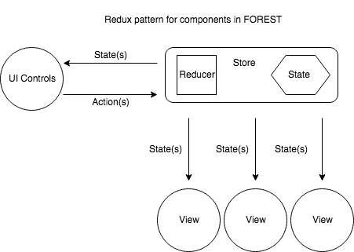

Build a component
-----------------

Components are objects that talk to the :class:`forest.redux.Store`,
they come in many flavours but the most common components
create bokeh widgets, connect events to actions and render themselves
on state change. A component does one or all of the following tasks

   - React to state changes
   - Send actions to middleware/reducers via ``store.dispatch``
   - Enable a pleasant user experience

The philosophy behind components is to be reactive, e.g. to be
told what to represent. State management is centralised into
a store such that all components have access to a joint
pool of knowledge

A user interface component typically has a two-way connection
with the Store, it can both send actions to the store to
be reduced and receive state updates to render itself. While rendering
it should not be possible to emit new actions. This behaviour is commonly
referred to as one-way data flow. One-way data flow is enforced by the
``forest.mark.component`` decorator.

The intention is for all components to connect themselves
to the store and be responsible for their own wiring. Most components
contain bokeh widgets, it is recommended to have a
single property `component.layout` that can be used
to embed the component into a document.

.. code:: python

   # Inside main.py connect a component
   component = Component().connect(store)

   # Embed component somewhere in the document (optional)
   document.add_root(component.layout)

When writing a new component a thought should be spared as
to how you expect it to interact with the Store. Essentially,
will it send messages to the store in a one-way fashion or
does it also need to react to the latest state? Or indeed,
is it a reactive component that renders itself on state
update?

.. code:: python

   from forest.mark import component

   @component
   class ReactiveView:
       """Re-render on state change"""
       ...
       def connect(self, store):
           # Views merely react to state changes
           store.add_subscriber(self.render)

       def render(self, state):
           # Called by store.dispatch
           pass

A simple user interface component should be able to
send messages to the store as and when a user interacts
with it.

.. note:: It is good practice to use the ``@component`` decorator
          to signal intention to  readers of the code
          and to enforce one-way data flow where necessary

Broadly speaking components connect to the store in either a one-way or
two-way manner. One-way components send messages to the store and do
not react to state changes. Two-way components both send messages and
re-render on state change.

.. code:: python

    @component
    class OneWayUI(Observable):
        # Only sends actions to the store
        def __init__(self):
            ...
            super().__init__()  # Needed for inheritance

        def connect(self, store):
            # Add store.dispatch to list of subscribers
            self.add_subscriber(store.dispatch)

        def on_event(self):
            self.notify(action())  # Sends "message" to store.dispatch

A more sophisticated piece of UI should also be able to
respond to state changes by updating its representation.

.. code:: python

    @component
    class TwoWayUI(Observable):
        # Same as OneWayUI but renders on state change
        ...
        def connect(self, store):
            # Store calls self.render with state
            store.add_subscriber(self.render)

            # Component sends actions to the store
            # when self.notify is called
            self.add_subscriber(store.dispatch)

        def on_event(self):
            self.notify(action())  # Sends "message" to store.dispatch

        def render(self, state):
            # Called by store with latest state

Centralising state management into a single entity is intended to
make reasoning about the application as a whole simpler.

.. warning:: Care must be taken to ensure that components do not modify state
             in a such a way as to trigger a infinite loop

In many circumstances reacting to every state change is a wasteful, specially
when intensive computation or i/o is involved. A better approach would be
to create a stream of the properties of interest and only swing into action
when those properties change.

.. code:: python

    from forest import rx  # minimalist functional reactive programming

    @component
    class EfficientUI(Observable):
        # Only renders when a property changes

        def connect(self, store):
            ...
            stream = (rx.Stream()
                .listen_to(store)
                .map(self.to_props)
                .distinct()
            )
            stream.map(lambda props: self.render(*props))

        def to_props(self, state):
            return (state.get('prop'),)

        ...

A simple way to achieve the same effect would be to assign props
to ``self.previous_props`` and to check during the render phase
if ``self.to_props(state)`` is equal to ``self.previous_props``. However, given
that we've already embraced functional programming principles
it makes sense to go the whole hog and use a stream.
