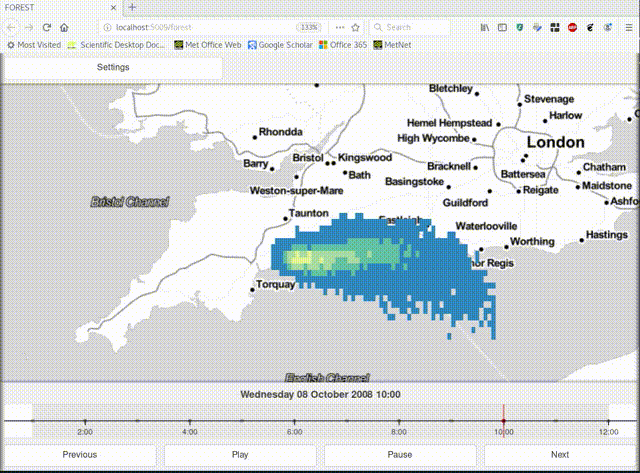

Getting started
===============

Welcome to the complete guide to FOREST. Learn how
to integrate FOREST into your existing work flow, build a
web portal or quickly view your model diagnostics alongside
observations.

Installation
------------

FOREST is distributed via conda through the `conda-forge` channel

.. code-block:: sh

  :> conda install -c conda-forge forest -y

Full documentation for conda can be found here: https://docs.conda.io/en/latest/

Who is FOREST for?
~~~~~~~~~~~~~~~~~~

FOREST is intended to provide a step change in exploration and
monitoring of forecasting systems. Technical and non-technical
users should be able to easily compare, interrogate and report on the
quality of forecasts.

While the primary intention of FOREST is to support research-mode activities
it should be trivial to use in an operational context. The underlying
technologies scale seemlessly from a single user running on a laptop
up to a fleet of EC2 instances running on AWS.

Tutorial
--------

FOREST comes with example cases intended to get users off the ground
quickly, reading about a tool is all well and good but nothing compares
to hands on experience.

.. code-block:: bash

   ~: forest-tutorial -h

The only argument `forest-tutorial` needs is a directory to place
files. Go ahead and run the tutorial command to
get your hands on some files that `forest` can analyse.

.. code-block:: bash

  ~: forest-tutorial .

The above snippet can be used to populate the current working directory with
all of the inputs needed to run the `forest` command line interface

Example - Unified model output
------------------------------

To display the unified model without any additional configuration simply
run the following command inside a shell prompt

.. code-block:: bash

  ~: forest --show unified_model.nc

Example - Atmospheric dispersion modelling
------------------------------------------

FOREST can be easily configured to view NAME outputs. The
tutorial ships with a configuration file and a directory containing
NAME text files. These files are compatible with the ``name.py`` driver
builtin to FOREST.

.. code-block:: yaml

   # contents of name-config.yaml
   files:
       - label: NAME
         pattern: 'NAME/*.txt'
         file_type: 'name'

To launch FOREST with NAME settings run the following command. A browser
tab will be launched by the ``--show`` flag.

.. code-block:: bash

   forest --show --config-file name-config.yaml

Once FOREST launches it is then possible to customize the color palette(s)
and limits, map backgrounds etc. to settings suitable to illustrate plumes
of contaminants.

.. note:: The NAME driver can be invoked with the ``--file-type=name`` command
          line option when running without a config file

Example - Rapidly developing thunderstorms
------------------------------------------

The above example shows how `forest` can be used in a similar mode to well-known
utilities, e.g. `xconv`, `ncview` etc. However, given we have a full Tornado
server running and the power of Python at our finger tips it would be
criminal to curtail our application. To go beyond vanilla `ncview` behaviour
try the following command:

.. code-block:: bash

  ~: forest --show --file-type rdt rdt_*.json

This should bring up a novel polygon geojson visualisation of satellite
RDT (rapidly developing thunderstorms). But wait, without the underlying
OLR (outgoing longwave radiation) layer the polygons by themselves are
of little value

.. code-block:: bash

  ~: forest --show --file-type eida50 eida50*.nc

It seems we are beginning to outgrow the command line, wouldn't it be
nice if we could store our settings and use them in a reproducible way!

Example - Multiple data sources
-------------------------------

Open up `multi-config.yaml` for an example of the settings that can be adjusted
to suit your particular use case.

.. code-block:: yaml

  files:
     - label: UM
       pattern: "unified_model*.nc"
       locator: file_system
       file_type: unified_model
     - label: EIDA50
       pattern: "eida50*.nc"
       locator: file_system
       file_type: eida50
     - label: RDT
       pattern: "rdt*.json"
       locator: file_system
       file_type: rdt

Running the following command should load FOREST with a model diagnostic,
satellite image and derived polygon product at the same time that can be
simultaneously compared.

.. code-block:: bash

   :> forest --show --config-file multi-config.yaml

Example - Going faster with SQL
-------------------------------

For very large data sets, file access and meta-data checking
becomes a bottle neck. Accessing thousands or even hundreds of files
to answer a single query can be time consuming, especially if your
files are stored in the cloud, e.g. in an S3 bucket. FOREST addresses
this issue by providing a facility to harvest the meta-data once, store
it in a database, and then use the database to quickly locate relevant
files.

To generate a database from scratch use the `forestdb` command.

.. code-block:: sh

  :> forestdb --database my-database.db my-file-*.nc

To make use of a database for a particular database, set the `locator`
to "database" and set `database_path` to the location of the database file.

.. code-block:: yaml

  files:
     - label: UM
       pattern: "*unified_model.nc"
       locator: database
       database_path: database.db
     - label: RDT
       pattern: rdt*.json
       locator: file_system
     - label: EIDA50
       pattern: eida50*.nc
       locator: file_system

.. note:: Database support is only available for unified_model file types

.. note:: Prefix pattern with wildcard `*` to enable SQL queries to find files
